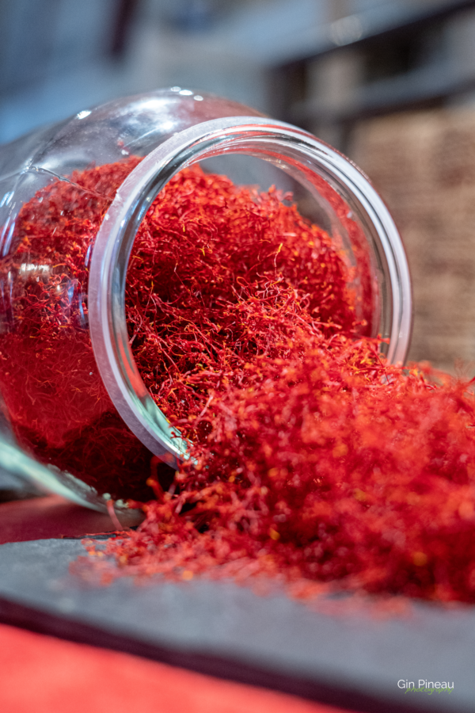

---
# Feel free to add content and custom Front Matter to this file.
# To modify the layout, see https://jekyllrb.com/docs/themes/#overriding-theme-defaults

layout: home
title: Accueil
permalink: /
---

# Une épice d'exception cultivée en touraine, au coeur du Val-de-Loire.

 

  

    C’est au <b>Sud de la Touraine, en pays de Richelieu</b>, au sein du parc Naturel Loire Anjou Touraine que nous avons planté notre safranière en <b>2007</b>, oeuvrant ainsi pour la diversification de l’exploitation agricole.
      
    Et depuis cette date, je me passionne pour le safran, sa culture, sa saveur, son arôme et c’est sur cette terre de séduction qu’est né  <b>« SafrandeVal »</b>.  
    Aujourd’hui, notre safranière s’étend sur un demi hectare, plantée sur des terrains argilo calcaires drainants.
  

  

    
  

 

 